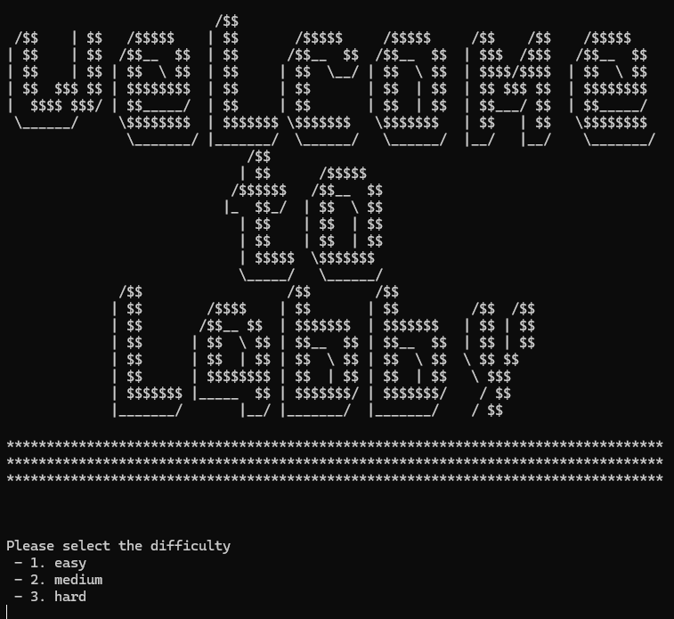
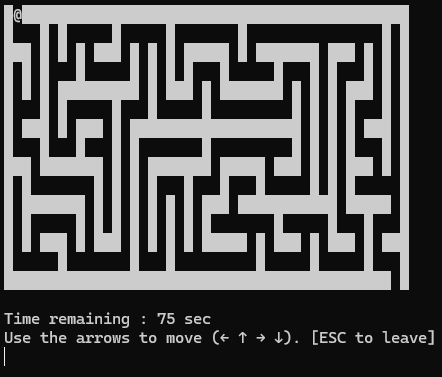
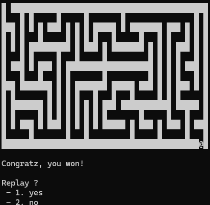

# Maze Game
by onizaro

## Description
This is a classical python maze game with multiple level and fully playable on any terminal with the keyboard arrows.

## Dependencies
- numpy
- random
- os
- time
- keyboard

To install a dependencie, run on the terminal:
```
pip install dependencie_name
```
It can be a different command depending on your OS.

## How to run the game
```
python grid.py
```
It can be a different command depending on your Python version.


## Some screenshots

- Landing screen



- Game page




- Endgame page




## To Do

- See if it's possible to remove the sparkling effect when holding keys
- Add a competition mode in case there is more than one player with score etc ...
- If there is a competition mode, maybe add some "stars" on the map that give more point to the personal score
- Store the score on a file